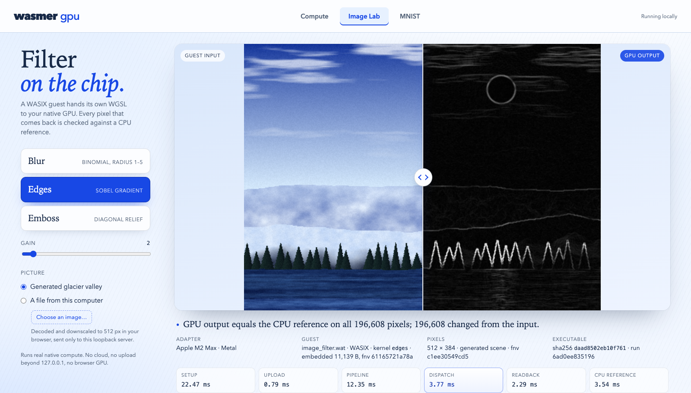
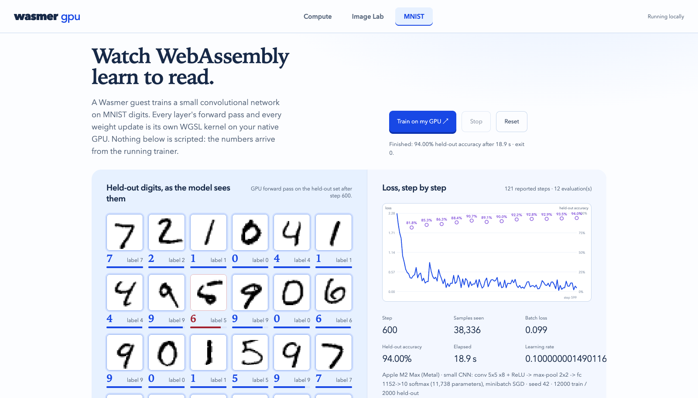
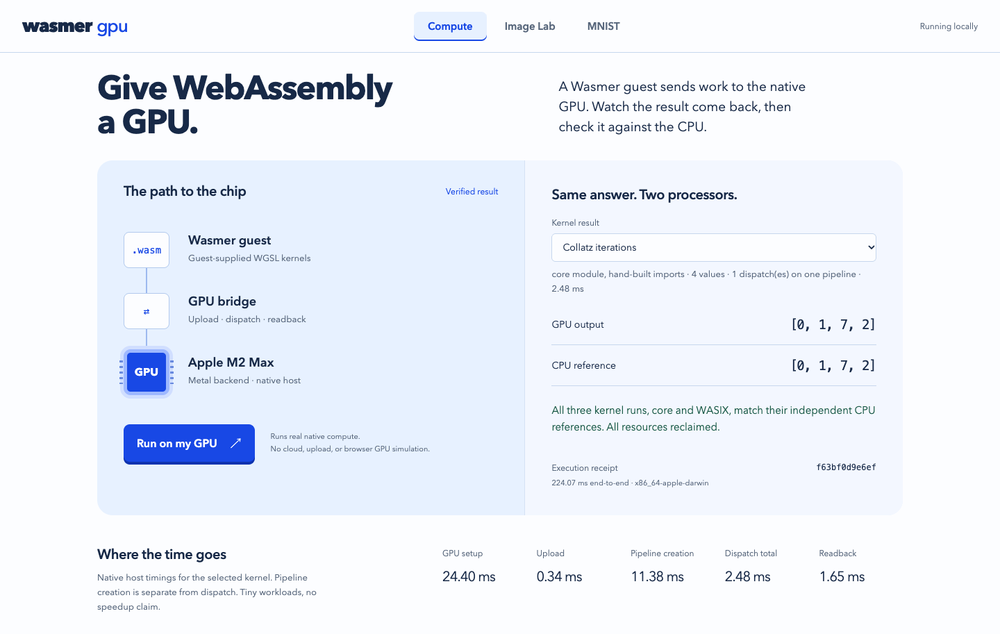

#+title: wasmer-gpu
#+startup: overview

*Wasmer guests can run native GPU workloads.* This proof of concept connects
guest-owned compute kernels to a native GPU through a small host bridge.
The bridge is the project; image filters and CNN training demonstrate that
the same interface supports substantially different workloads.

One local application, three demos:
- *Compute*: guest-owned WGSL kernels and the Wasmer host bridge.
- *Image Lab*: blur, edges and emboss on an image, with a before/after reveal.
- *MNIST*: train a small convolutional network, watch its held-out predictions,
  then draw a digit and classify it with the trained weights.

The browser is the control surface. Wasmer executes the WebAssembly guests;
their GPU work reaches the native adapter through ~wgpu~. The MNIST drawing
pad runs inference in the browser using the parameters from the real training
run. There is no cloud service, browser-GPU simulation or canned training trace.

* Screenshots
Real captures from the local three-tab application.

** Image Lab
Guest-supplied edge detection on the native GPU, with a before/after reveal
and pixel-for-pixel verification against the CPU reference.

#+attr_html: :width 1000 :alt Image Lab showing a glacier scene beside its GPU edge-detection result

** MNIST training
A completed CNN run: 600 steps, 94% held-out accuracy, live predictions and
the recorded loss curve. These are observed results from this run.

#+attr_html: :width 1000 :alt MNIST training dashboard with digit predictions, loss curve and 94 percent held-out accuracy

** Compute
The Wasmer-to-GPU path, independently checked output and measured dispatch
costs. Tiny workloads demonstrate the bridge, not a speedup claim.

#+attr_html: :width 1000 :alt Compute tab showing the Wasmer guest to native GPU bridge and matching CPU and GPU results

* Watch it
- [[file:recordings/take-2-image-demo.mp4][Image processing]] — 62 seconds: edges, emboss, blur and the live reveal.
- [[file:recordings/mnist-training.mp4][MNIST training]] — 27 seconds: a fresh CNN run reaching 94% held-out accuracy.

Both clips are silent, normal-speed recordings. [[file:recordings/README.org][Recording notes]]
state their exact scope and limitations. [[file:HANDOFF.org][Technical handoff]] contains
the short demo story, code entry points and questions for Wasmer maintainers.

* Run the application
Requirements: Rust with the ~stable~ toolchain, Python 3 and a supported native
GPU. Tested on macOS with Apple M2 Max / Metal; other platforms are unverified.
The first Cargo build fetches the pinned Wasmer/WASIX dependency and can take
several minutes.

From this checkout:
#+begin_example sh
cargo +stable build --release --locked --manifest-path wasmer-gpu-demo/Cargo.toml
python3 wasmer-gpu-demo/web/hub/server.py
#+end_example
Open http://127.0.0.1:8764. Switch between *Compute*, *Image Lab* and *MNIST*.
Switching tabs keeps results and training alive. Ctrl-C stops the server and
its owned trainer. Nothing listens on an external interface.

MNIST needs the four official IDX files; they are not included in Git:
#+begin_example sh
mkdir -p wasmer-gpu-demo/data/mnist
(
  cd wasmer-gpu-demo/data/mnist
  for f in train-images-idx3-ubyte train-labels-idx1-ubyte t10k-images-idx3-ubyte t10k-labels-idx1-ubyte; do
    curl -fL -o "$f.gz" "https://storage.googleapis.com/cvdf-datasets/mnist/$f.gz" &&
      gunzip -kf "$f.gz" || exit 1
  done
)
#+end_example
Source: [[https://github.com/cvdfoundation/mnist][CVDF MNIST mirror]]. The trainer
validates IDX shape/counts and records file hashes. Without these files,
Compute and Image Lab still work; the MNIST tab reports the missing data.

* The CNN
One convolutional layer (eight 5x5 filters), ReLU, 2x2 max pooling and a
10-class fully connected output: 11,738 parameters, minibatch SGD. The
default run uses the first 12,000 official training images and the first
2,000 official test images, held out from training.

A recorded 600-step run reached *94% held-out accuracy* (1,880/2,000) in
18.9 seconds on the demo machine. That is an observed run, not a guarantee
or a speedup claim. The page shows its own run's actual metrics.
See [[file:wasmer-gpu-demo/docs/MNIST.org][model and training details]].

* Architecture and limits
#+begin_example
Browser tabs -> one loopback server -> fixed native runners
                                      -> Wasmer / WASIX guests
                                      -> wasmer_gpu_v0 host imports
                                      -> wgpu -> native GPU
#+end_example
The hook supplies instance-owned buffers/pipelines, resource bounds and
guest-supplied WGSL. It is an experimental compute subset, not a complete
WebGPU binding or a proven sandbox for hostile GPU shaders. This is not a
training framework or a claim that MNIST needs WebAssembly.

- Only Apple M2 Max / Metal has been exercised here; portability is unverified.
- The ABI is experimental, not a complete WASI WebGPU implementation.
- Hand-drawn inputs differ from MNIST; held-out accuracy is not drawing-pad
  accuracy. The complete recording includes a misclassified drawn seven.
- Image kernels are embedded in their executable. Compute and MNIST still
  load guest assets from their build checkout; keep those assets with the binary.
- Do not expose the local HTTP server publicly or treat the shader quotas as
  a hostile-code security guarantee.

The next step is to validate the bridge/API with Wasmer maintainers, not add
another demonstration or a cloud scheduler.

- [[file:wasmer-gpu-demo/web/hub/README.org][Tabbed app, mounts and checks]]
- [[file:wasmer-gpu-demo/web/image/README.org][Image workbench]]
- [[file:wasmer-gpu-demo/docs/DEMO.org][Bridge API and execution notes]]

Built for the Wasmer sponsor track at the September 2026 AI Security Hackathon.

* License
MIT. See [[file:LICENSE][LICENSE]].
